```mermaid
flowchart TD

A[Need PostgreSQL adapter?] --> B[Development / Testing?]
B -->|Yes| C[Use psycopg2-binary✔ Precompiled✔ Easy install⚠ Not for production]
B -->|No| D[Use psycopg2✔ Requires system libs✔ Stable✔ Production-ready]

```

## 🔹 psycopg2

- Source distribution (C extension)
    
- Requires compilation at install time
    
- Needs PostgreSQL client libraries + development headers (`libpq-dev`, `python3-dev`, etc.)
    
- ✅ Recommended for **production** (stable, optimized)
    
- ⚠️ Installation can fail if build tools/system libs are missing
    

`pip install psycopg2`

---

## 🔹 psycopg2-binary

- Precompiled wheel distribution (binary build)
    
- No compilation needed → faster/easier install
    
- ✅ Great for **development & testing**
    
- ⚠️ Not recommended in **production** (larger binaries, may lag behind, runtime issues possible)
    

`pip install psycopg2-binary`

---

## 🔹 Official Recommendation

- Use **`psycopg2-binary`** for **development**
    
- Use **`psycopg2`** for **production deployments**
    

---

## 🔹 Best Practice in `requirements.txt`

`# Development psycopg2-binary>=2.9  # Production # psycopg2>=2.9`

Or conditional:

`psycopg2-binary; sys_platform == "win32" psycopg2; sys_platform != "win32"`

---

## ✅ Summary

- **psycopg2** → Source build, needs system libs, best for **production**
    
- **psycopg2-binary** → Precompiled, easy install, best for **development/testing**