What are they?
	- Design Patterns are well tested, reusable solutions
	- They are like a `solution template` for how to solve common software engineering problems
	- Flexible and adaptable
	- Save time because they are optimal

Why Use them?
	- you know that you are using something that has been utilized successfully in countless projects before
	- They are like a common `meta-language` for developers. If you and I both know what a `singleton pattern` is then we already have a common understanding of everything about how it would be used or how it should be implemented #Common-Vocab
	- Language agnostic

# Design Pattern Families

## Creational
- Focuses on **object creation mechanisms** to make the system independent of how objects are created.  

## Structural
- Focuses on **class and object composition** to form larger structures while keeping them flexible and efficient.  

## Behavioral
- Focuses on **object interaction and responsibility distribution** to simplify communication and behavior.  

---

## Mermaid Mindmap

# 🎨 Design Patterns

## 1. 🌱 Creational Patterns

```mermaid
mindmap
  root((🌱 Creational Patterns))
    🟢 Singleton
      🔹 One instance shared (e.g., logging, DB connection)
    🟢 Factory Method
      🔹 Subclass decides which object to create
    🟢 Builder
      🔹 Construct complex objects step by step
    🟢 Prototype
      🔹 Clone objects without depending on class
```

## 2. 🏗️ Structural Patterns

```mermaid
mindmap
  root((🏗️ Structural Patterns))
    🟠 Adapter
      🔹 Make incompatible interfaces work together
    🟠 Decorator
      🔹 Add functionality dynamically (Python @decorators)
    🟠 Facade
      🔹 Unified interface hiding subsystem complexity
    🟠 Proxy
      🔹 Control access (lazy init, security, caching)
    🟠 Composite
      🔹 Tree structure (objects + groups treated same)
```

## 3. 🎭 Behavioral Patterns

```mermaid
mindmap
  root((🎭 Behavioral Patterns))
    🔴 Strategy
      🔹 Swap algorithms at runtime (e.g., sorting)
    🔴 Observer
      🔹 Notify subscribers (pub-sub, event systems)
    🔴 Command
      🔹 Encapsulate actions (undo/redo, task queues)
    🔴 Iterator
      🔹 Sequentially access collections (Python iterators/generators)
    🔴 State
      🔹 Change behavior as internal state changes
    🔴 Template Method
      🔹 Skeleton of algorithm, subclasses fill steps
```

