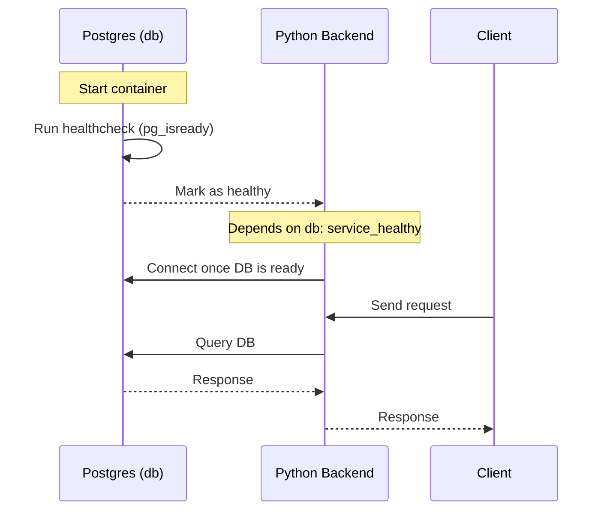
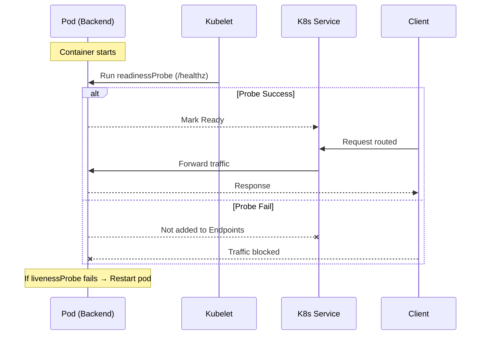

This note provides sequence diagrams to compare how service readiness works in **Docker Compose** vs **Kubernetes**.

👉 In **Kubernetes**, healthchecks (liveness & readiness probes) are **not optional** when you’re running **scalable, production workloads**.

## 🔹 1. What Happens Without Healthchecks?

If you don’t define healthchecks:

- Kubernetes only knows whether the container process is **running**, not if the app inside is **ready**.
    
- This causes problems:
    
    - **Service discovery issues** → Traffic routed to pods that aren’t ready yet.
        
    - **Rolling updates fail** → New pods start but aren’t healthy → Users hit errors.
        
    - **Auto-scaling issues** → More pods spun up, but some may never become usable.

## 🔹 2. Kubernetes Probes (Healthchecks)

K8s has two main probes:

### ✅ Readiness Probe

- **Purpose**: Decides if a Pod is ready to receive traffic.
    
- If the readiness probe fails → Pod is removed from Service Endpoints.
    

**Example (check HTTP endpoint):**

```yaml
readinessProbe:
  httpGet:
    path: /healthz
    port: 8000
  initialDelaySeconds: 5
  periodSeconds: 10

```


---

### ✅ Liveness Probe

- **Purpose**: Detects if a Pod is stuck or deadlocked.
    
- If it fails → K8s kills and restarts the Pod.
    

**Example (check TCP port):**

```yaml
livenessProbe:
  tcpSocket:
    port: 8000
  initialDelaySeconds: 10
  periodSeconds: 15

```

---

## 🔹 3. Why Healthchecks are Critical When Scaling

When scaling replicas in Kubernetes:

- **Load Balancing**: Readiness probes ensure only _healthy pods_ are added to load balancers.
    
- **Self-Healing**: Liveness probes automatically restart crashed pods.
    
- **Rolling Updates**: New pods must pass readiness before old ones are stopped → zero-downtime deployments.
    
- **HPA (Horizontal Pod Autoscaler)**: Extra pods spun up during scaling must pass readiness before handling traffic.
    

Without healthchecks → you get **traffic blackholes, cascading failures, and downtime**.

---

## 🔹 4. Best Practices

- Always define **readiness probes** for web services.
    
- Add **liveness probes** if your service can deadlock/hang.
    
- Use **startup probes** for apps that need long initialization.
    
- Make probes **lightweight** (e.g., ping DB connection pool, not full queries).
    
- Mirror what you tested in Docker Compose (`healthcheck`) but adapt to K8s YAML.


## 🐳 Docker Compose (depends_on + healthcheck)





👉 Backend waits for DB to be **healthy** before starting.




👉 Traffic only flows when pod passes **readiness probe**.
## 📖 Takeaway

- **Compose**: Sequential startup with `depends_on` + healthcheck.
    
- **Kubernetes**: Continuous health monitoring via probes.
    
- In Kubernetes, probes aren’t just about startup — they ensure **ongoing correctness at scale**.