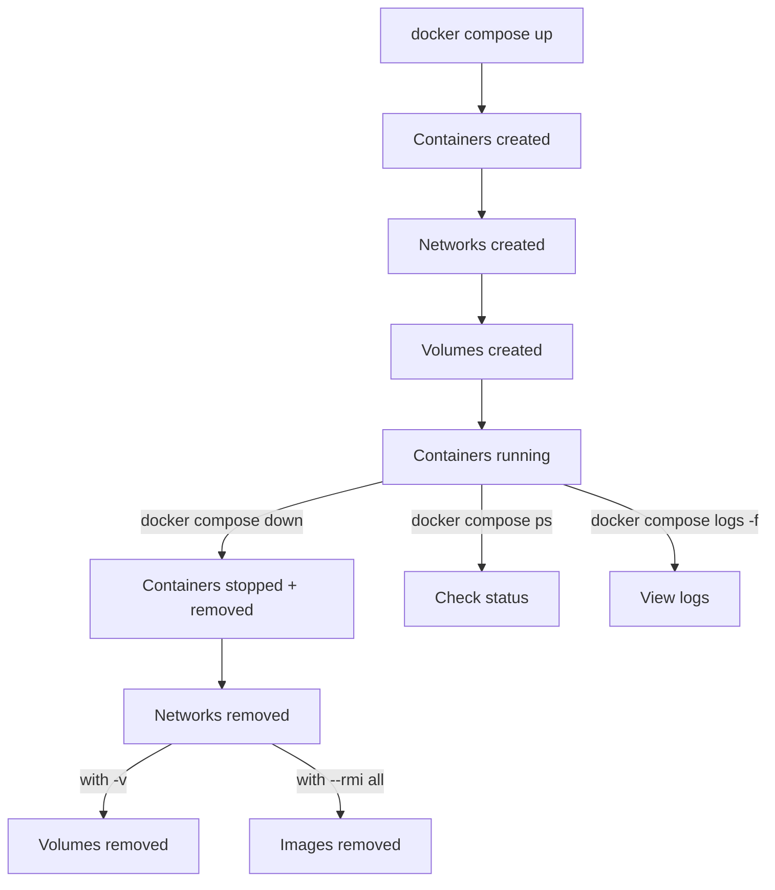

## 🔹 `docker compose up`

- Creates and starts containers defined in `docker-compose.yml`
- Builds images if needed
- Creates networks and volumes if not already existing
    
### Common usage:

```bash
docker compose up        # start in foreground (logs visible)
docker compose up -d     # start in detached mode
docker compose up --build  # rebuild images before starting
```

---

## 🔹 `docker compose down`

- Stops containers
- Removes containers created by Compose
- Removes networks created by Compose
- Optionally removes **volumes** and **images**
    

### Common usage:

```bash
docker compose down        # stop + remove containers + networks
docker compose down -v     # also remove volumes (⚠️ deletes data)
docker compose down --rmi all  # also remove images
docker compose down --remove-orphans  # clean up unused/renamed services

```

---

## 🔹 Typical Workflow

```bash
docker compose up -d     # start services in background
docker compose ps        # check running containers
docker compose logs -f   # view logs
docker compose down      # stop and clean up

```

---

## ✅ Summary

- **`up`** → create + start containers, networks, volumes.
- **`down`** → stop + remove containers, networks (optionally volumes/images).
- Use `-v` with `down` carefully (removes data).