## 🔹 Why Volume Mounting?

- By default, container data is **ephemeral**.
- Volumes allow:
    - Persistence of data
    - Sharing files between host ↔ container

Types:
- **Bind mounts** → Map host dir/file into container
- **Volumes** → Managed by Docker
- **tmpfs** → In-memory storage

```mermaid
flowchart TD

A[Docker Data Storage Options]

A --> B[Volumes]
A --> C[Bind Mounts]
A --> D[tmpfs Mounts]

%% Volumes branch
B --> B1[Managed by Docker]
B1 --> B2[Best for persistent data]
B2 --> B3[Use in production]
B3 --> B4[Example: Database storage]

%% Bind Mounts branch
C --> C1[Maps host path ↔ container path]
C1 --> C2[Best for development]
C2 --> C3[Live reload of source code]
C3 --> C4[Example: ./src → /app]

%% tmpfs branch
D --> D1[In-memory only]
D1 --> D2[Fast but ephemeral]
D2 --> D3[Use for sensitive/temp data]
D3 --> D4[Example: Cache, secrets]

```





### 📌 Volumes in Docker Compose
##### 1. Bind Mount (development)

   ```yaml
version: "3.9"

services:
  app:
    image: python:3.10
    volumes:
      - ./src:/app
    working_dir: /app
    command: python main.py

```

##### 2. Named Volume (production)
```yaml
version: "3.9"

services:
  db:
    image: mysql:8
    environment:
      MYSQL_ROOT_PASSWORD: root
    volumes:
      - mysql_data:/var/lib/mysql

volumes:
  mysql_data:
```

##### 3. Mixed Example

```yaml
version: "3.9"

services:
  app:
    build: .
    volumes:
      - ./src:/app     # bind mount
  db:
    image: postgres:14
    volumes:
      - pgdata:/var/lib/postgresql/data  # named volume

volumes:
  pgdata:

```

## ✅ Best Practices

- Use **bind mounts** → in dev (live reload of code).
- Use **named volumes** → in prod (persistent, managed storage).
- Use **tmpfs** → for sensitive or temporary data.