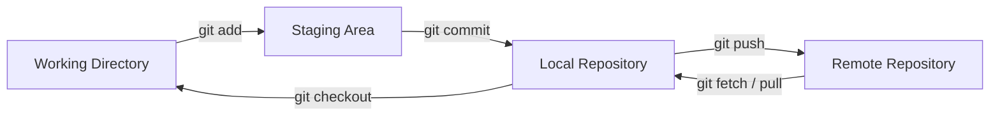

```mermaid
flowchart LR

A[Working Directory] -->| git add | B[Staging Area]
B -->| git commit | C[Local Repository]
C -->| git push | D[Remote Repository]

D -->| git fetch / pull | C
C -->| git checkout | A
```

